# Hope Harmony | Richard Fletcher

## Code Institute - Solo Project 1

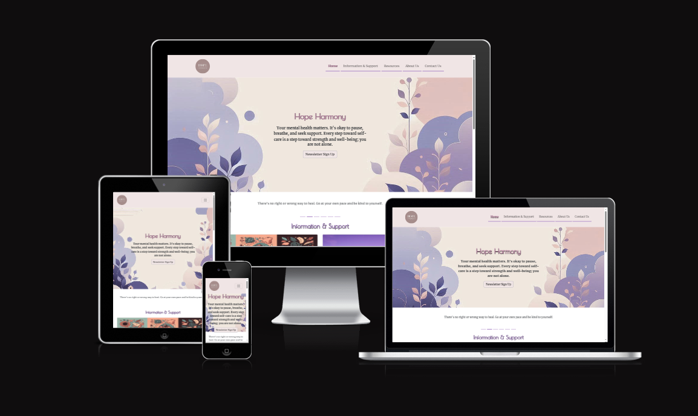

## Table of Contents

- [About](#about)
- [User Value Explanations](#user-value-explanations)
- [Design](#design)
- [Features](#general-features)
- [Pages](#pages)
    - [Home Page](#home-page)
    - [Recources Page](#recources-page)
    - [About Us Page](#about-us-page)
    - [Contact Us Page](#contact-us-page)
- [AI Overview](#ai-overview)
- [Things to be Improved](#things-to-be-improved)
- [Technologies Used](#technologies-used)
- [Image Sources](#image-sources)
- [Logo Sources](#logo-sources)
- [Java Script Sources](#java-script-sources)
- [Validation](#validation)
    - [HTML](#html)
    - [CSS](#css)
- [Lighthouse Performance](#lighthouse-performance)
    - [Mobile](#mobile)
    - [Desktop](#desktop)
- [Wireframes](#wireframes)
    - [Home Wireframe](#home-wireframe)
    - [About Us Wireframe](#about-us-wireframe)
    - [Contact Us Wireframe](#contact-us-wireframe)
    - [Resources Wireframe](#resources-wireframe)

## About

Hope Harmony is a non-profit organization dedicated to providing mental health support, information, and resources. Our mission is to help individuals achieve mental well-being through accessible support and advice.

Hope Harmony aims to support individuals facing mental health challenges by offering a variety of resources, including information on mental health issues, links to external support organizations, and a platform for community engagement.

## User Value Explanations

### Accessible Mental Health Support

- **Value**: Users can access a wide range of mental health resources and support services from the comfort of their own homes.
- **Explanation**: Hope Harmony provides comprehensive information on mental health issues, links to external support organizations, and a platform for community engagement. This ensures that users can find the help they need, regardless of their location or circumstances.

### Responsive Design

- **Value**: Users can access the website on any device, ensuring a seamless experience whether they are using a desktop, tablet, or smartphone.
- **Explanation**: The website is designed to be fully responsive, adapting to different screen sizes and devices. This makes it easy for users to navigate and find the information they need, no matter how they choose to access the site.

### Newsletter Sign-Up

- **Value**: Users can stay informed about the latest mental health resources, events, and updates by signing up for the newsletter.
- **Explanation**: The website offers a simple and convenient way for users to subscribe to the Hope Harmony newsletter. By providing their email address, users can receive regular updates and valuable information directly in their inbox.

### Community Engagement

- **Value**: Users can connect with others who are facing similar challenges, fostering a sense of community and support.
- **Explanation**: Hope Harmony encourages community engagement through various features, such as social media links and information about team members. This helps users feel connected and supported, knowing that they are not alone in their journey.

### Comprehensive Resources

- **Value**: Users have access to a wealth of information and resources on mental health, including articles, self-help materials, and links to external organizations.
- **Explanation**: The website provides detailed information on various mental health topics, as well as links to reputable external resources. This ensures that users can find the support and information they need to manage their mental health effectively.

### Professional Support

- **Value**: Users can access professional support and advice from trained mental health professionals.
- **Explanation**: Hope Harmony's team includes experienced mental health professionals who are dedicated to providing support and advice. Users can feel confident that they are receiving reliable and professional guidance.

### Privacy and Confidentiality

- **Value**: Users can trust that their personal information and interactions on the website are kept private and confidential.
- **Explanation**: Hope Harmony is committed to protecting users' privacy and ensuring that their personal information is handled with care. The website includes clear privacy policies and secure methods for handling user data.

### Easy Navigation

- **Value**: Users can easily find the information and resources they need, thanks to the website's intuitive navigation and clear layout.
- **Explanation**: The website is designed with user experience in mind, featuring a clean and organized layout. This makes it easy for users to navigate the site and quickly find the information they are looking for.

## Design

- **Colours**: I researched colours typically associated with mental health and purple was the main colour. I created my colour scheme basing off a pastel purple for a calm and relaxing feel to my site. The colours used are listed below.
    - Light purple: #b5a7ce
    - Dark purple: #aa85c9
    - Peach: #f1e5e5
    - Pink: #debec5
    - Grey: #aeaeb6
    - Dark pink: #c28ba9

- **Fonts**: I used 2 different fonts on the site one for the headers and the other for all other text. I picked fonts which are easy to read and of a calming nature. The fonts are listed below.
    - Main font: [Merriweather](https://fonts.google.com/specimen/Merriweather) and serif
    - Header font: [Poiret One](https://fonts.google.com/specimen/Poiret+One) and sans-serif

- **Images**: I used [Leonardo AI](https://leonardo.ai) and [Co-pilot](https://copilot.microsoft.com/images/create) to generate the hero image and profile pictures for my about us page. The Logos were sourced mostly from each companies website they're listed further below. I also used [Unsplash](https://unsplash.com) for the card images on the Home page. I made my favicons using [RealFaviconGenerator](https://realfavicongenerator.net/).

## General Features

- **Responsive Design**: The website is fully responsive and works on all devices.
- **Navbar**: Fully responsive, collapses on smaller devices and expands on larger devices.
- **Footer**: Includes quick links for better navigation. Has social media links to relevant webpages and contact information.

## Pages

### Home Page

- **Newsletter**: Call to action button below page title. Opens a modal with a form. Submit button takes you to success message page.
- **Quotes Carousel**: An auto playing carousel with uplifting quotes 
- **Information & Support**: Bootstrap cards with images and description about support and wellbeing. Buttons to external websites for more help and information

### Resources Page

- **Resources**: Information for all different external websites for helping with different mental health issues. Logos included for each website and button to take you to each website. 

### About Us Page

- **Company Mission Statement**: Overview of Hope Harmony talking about the company, it's mission and values
- **Team Carousel**: Profile picture of each team member, with their name and title. Also gives a brief introduction to each team member. 

### Contact Us Page

- **Contact Form**: A form to sumbit feedback. On Completion takes to another success page to confirm action  has been done. 

## AI Overview

AI was used throughout my project. Some areas of code was generated using Co-Pilot, it was also used for debugging purposes however it did still miss some errors. I did find it very helpful to generate blocks of basic code which saved time allowing me to focous in other areas. I also used AI to generate the information on my page to save time having to research. It was also used to generate a lot of images. 

## Things to be Improved

- **Contact Form**: Doesn't quite align to the center of the page so it will need centering.
- **Mobile Performance**: Performance quite low on mobile due to hero section need further testing and optimisation.

## Technologies Used

- **HTML5**: For structuring the content.
- **CSS3**: For styling the website.
- **Bootstrap 5**: For responsive design and components.
- **JavaScript**: For interactive elements and form validation.
- **FontAwesome**: For icons.
- **Co-Pilot**: For code generation and debugging.
- **Chat-GPT**: For information generated about companies and advice across all pages.

## Image Sources

- **Unspash**: https://unsplash.com (used on main page cards)
- **Leonardo AI**: https://leonardo.ai (used to make logo and images of team)
- **Co-Pilot**: https://copilot.microsoft.com/images/create (Used to create hero image and card image)

## Logo Sources

- **Kooth logo**: https://www.togetherforchildren.org.uk/Kooth
- **NHS logo**: https://peopleshistorynhs.org/encyclopaedia/branding/
- **Mind logo**: https://nspa.org.uk/member/mind/
- **Selfhelp logo**: https://www.selfhelp.org.uk/
- **Samaritans logo**: https://www.helpinpreston.com/article/4414/Samaritans
- **Help for Heroes logo**: https://www.helpforheroes.org.uk/give-support/partner-with-us/brand-asset-library/help-for-heroes-logo/
- **Movemeber Foundation Logo**: https://en.wikipedia.org/wiki/Movember
- **Young Minds Logo**: https://nptmind.org.uk/young-minds-logo/

## Java Script Sources

**Code for Check Boxes** - https://stackoverflow.com/questions/76508679/how-do-i-require-at-least-one-checkbox-to-be-selected

Thank you for visiting Hope Harmony. Your mental health matters, and we are here to support you.

## Validation

### HTML

**Home Page**

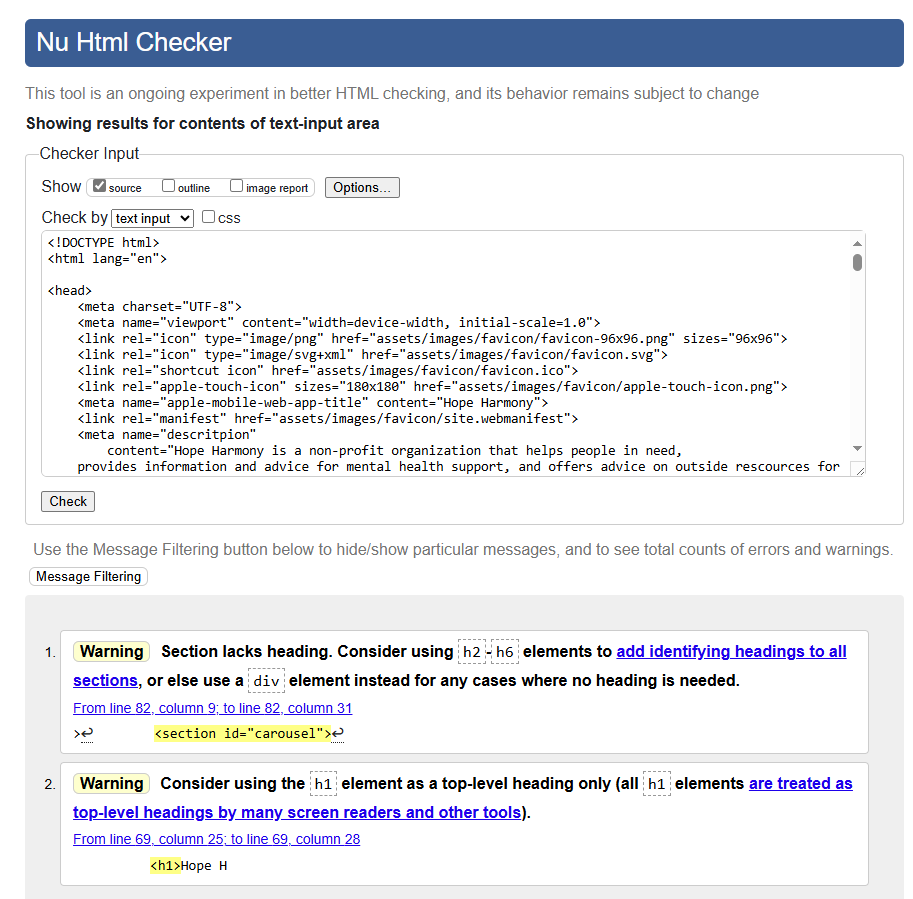

**About Us Page**
Wireframe
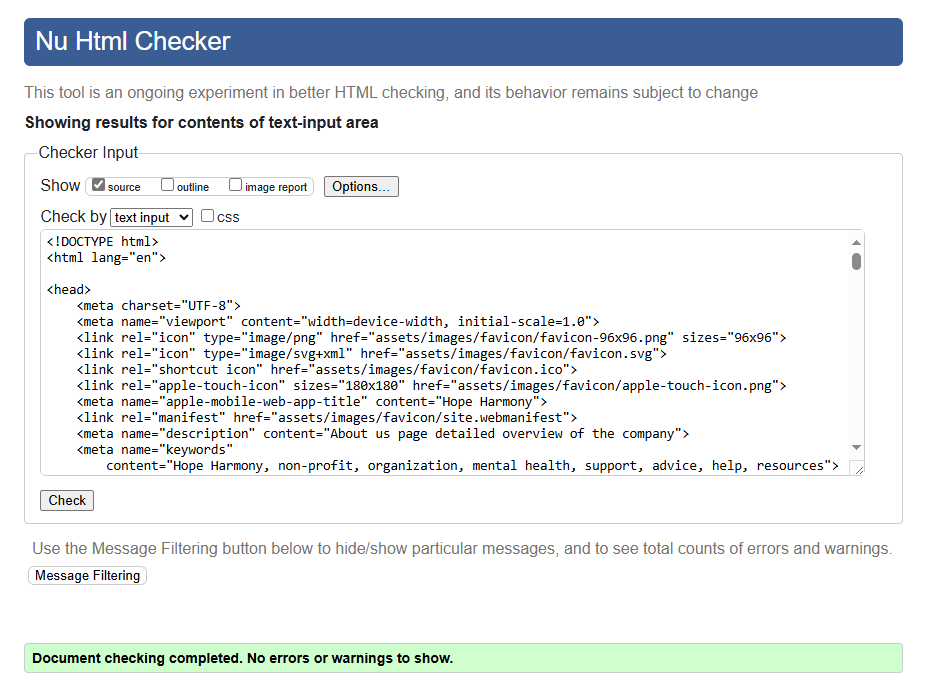

**Contact Us Page**

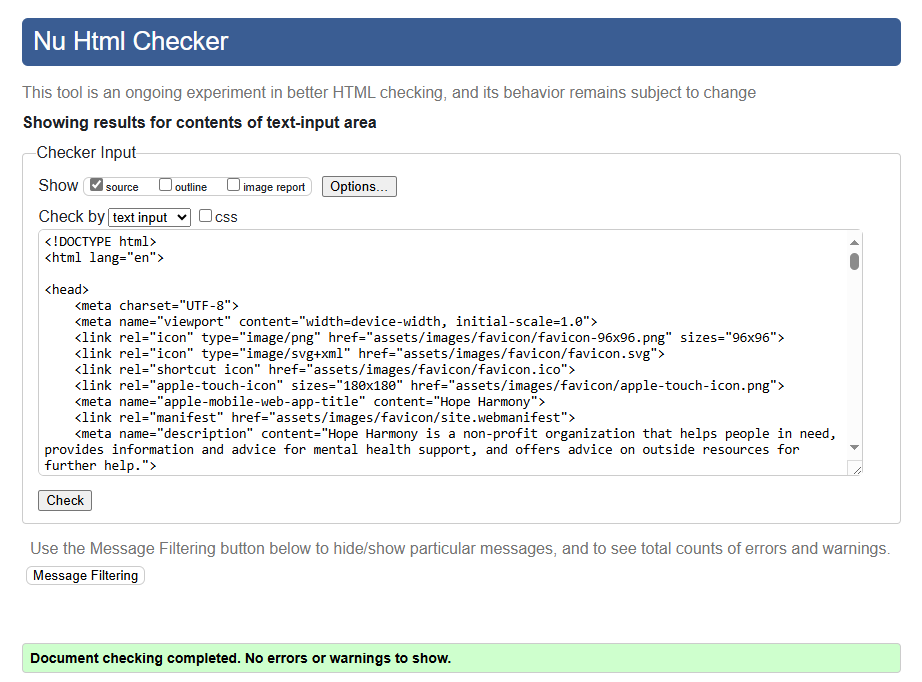

**Resources Page**

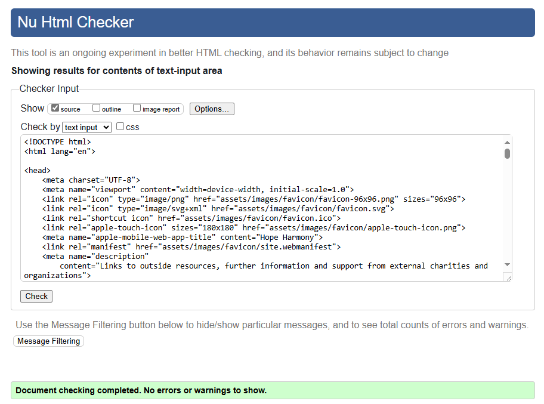

**Success Page**

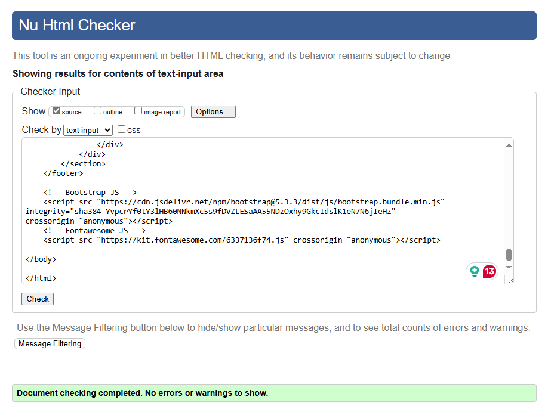

**Success-2 Page**

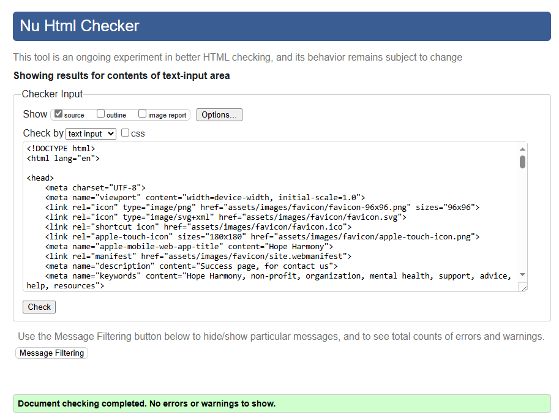

### CSS

**Style.css**

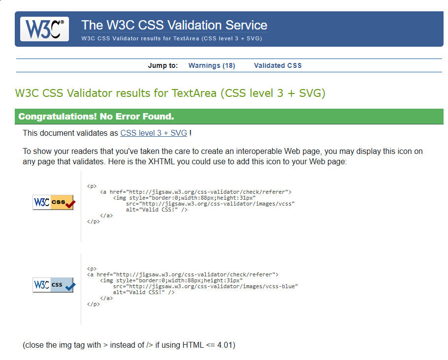

## Lighthouse Performance

### Mobile
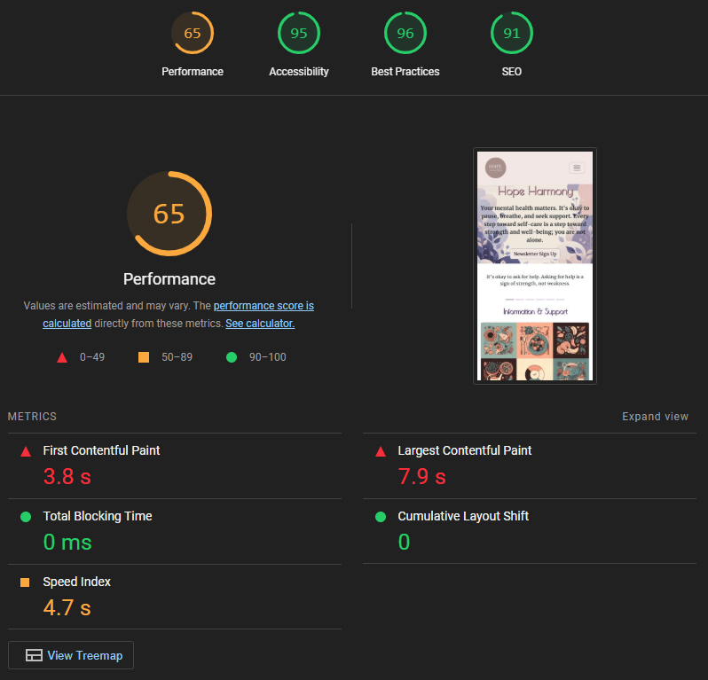

### Desktop
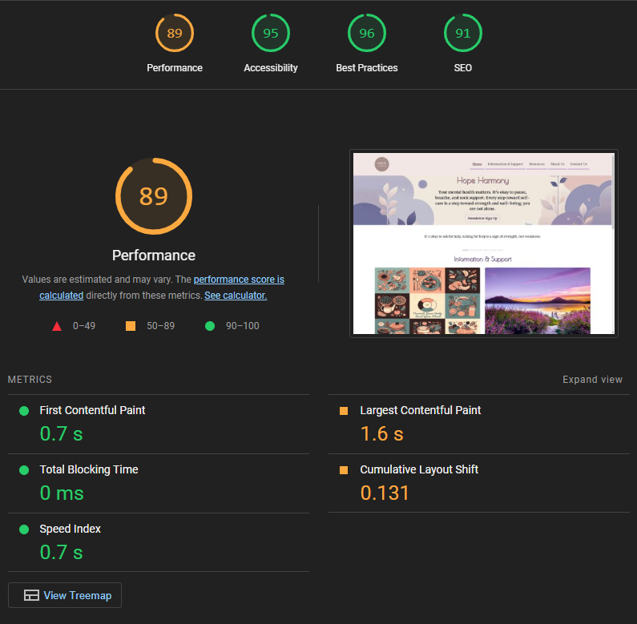

## Wireframes

### Home Wireframe

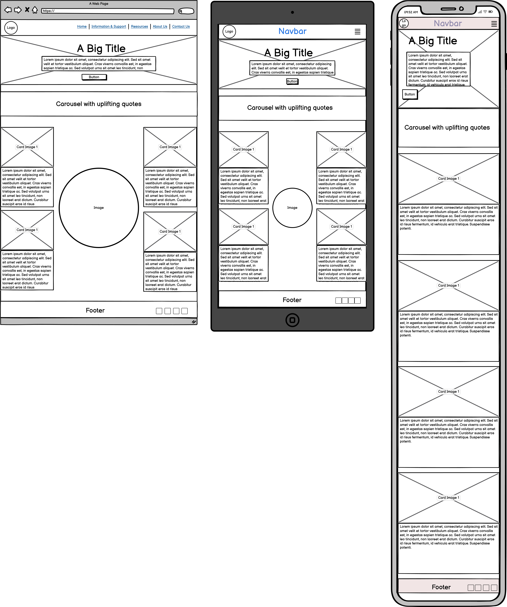

### About Us Wireframe

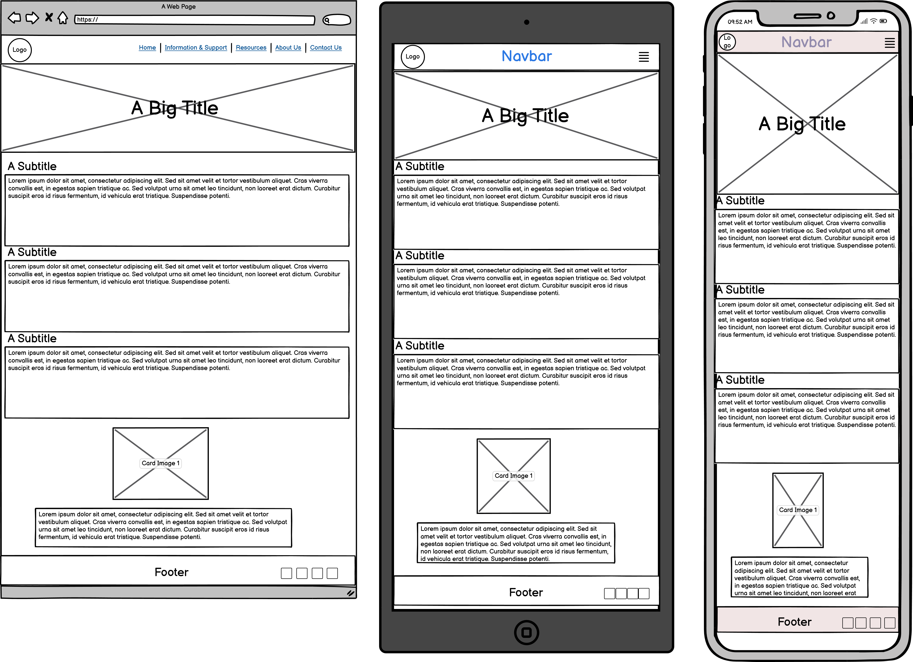

### Contact Us Wireframe

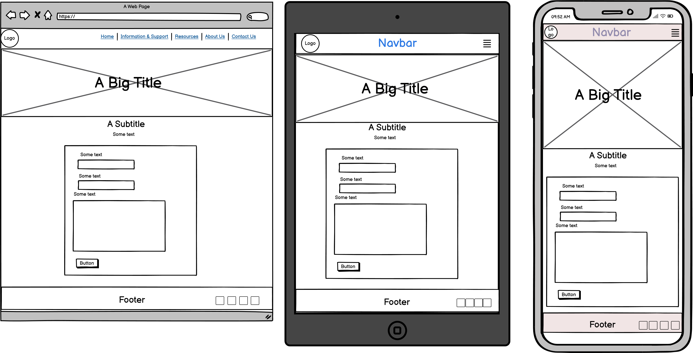

### Resources Wireframe

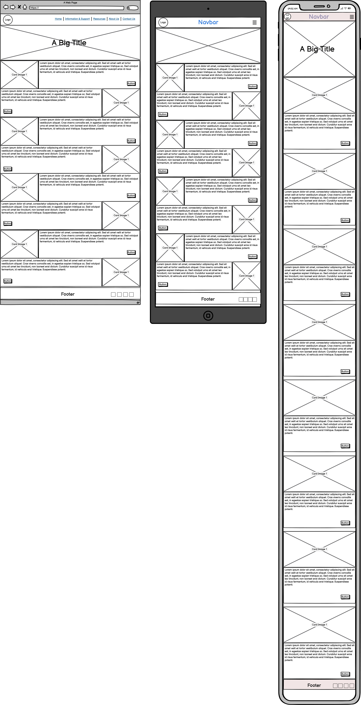